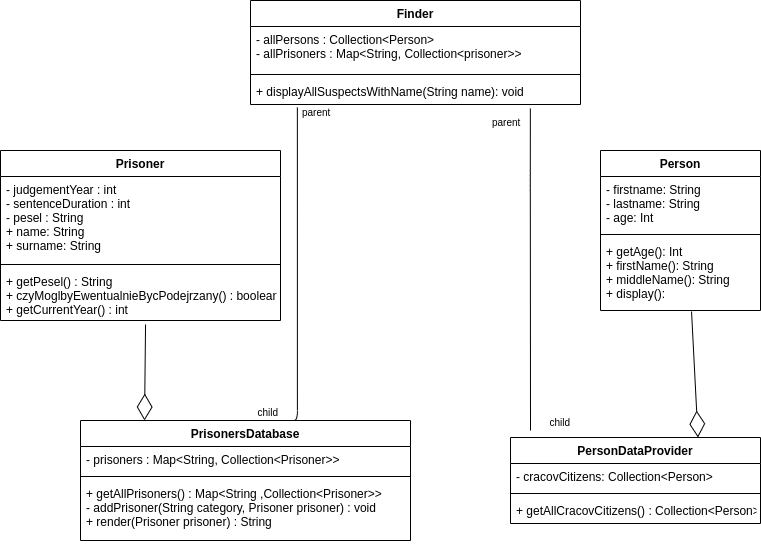

# Lab 4 Refaktoryzacja
### Autor: Krzysztof Hardek
## Zad 4.1
Mój diagram jest taki sam jak w instrukcji, ale dodałem jeszcze kilka pól:  
  
Zmiany, które chciałbym wprowadzić:
* Nazewnictwo
    1. Poprawa literówek np. persons -> people
    2. Skrócenie nazw np. allPrisoners -> Prisoners
    3. Wyeliminowanie "Ponglish" np. czyMóglbyEwentualnieBycPodejrzeny() -> canBeSuspected()
    4. Właściwe nazwy geterów oraz seterów np. firstname() -> getFirstname()
    5. Wyeliminowanie nieadekwatnych nazw metod np. middlename() zwraca lastname
* Widoczność metod i pól
    1. Dodanie geterów oraz seterów tam gdzie ich nie ma
    2. W klasie Prisoner name oraz surname powinny być prywatne
* Hierarchia klas
    1. Generalizacja Klas Prisoner oraz Person, gdzyż mają dużo wspólnego
    2. To samo tylko z klasami PersonDataProvider i PrisonerDatabase
## Zad 4.2
### Klasa Person
Dodałem setery oraz getery. Zmieniłem nazwę display na toString bo taką funkcje realizuje.
```java
public class Person {
    private String firstname;

    private String lastname;

    private int age;

    public Person(String firstname, String lastname, int age) {
        this.age = age;
        this.firstname = firstname;
        this.lastname = lastname;
    }

    public int getAge() {
        return age;
    }

    public String getFirstname() {
        return firstname;
    }

    public String getLastname() {
        return lastname;
    }

    public void setAge(int age) {
        this.age = age;
    }

    public void setFirstname(String firstname) {
        this.firstname = firstname;
    }

    public void setLastname(String lastname) {
        this.lastname = lastname;
    }

    public String toString() {
        return firstname + " " + lastname;
    }
}
```
### Klasa Prisoner
Zmieniłem pola publiczne na prywatne, oraz dodałem getery i metodę toString. Skomplikowana polska nazawa została zmieniona na angielską oraz jest teraz bardziej adekwatna do zwracanej wartości.
```Java
public class Prisoner {
    private final int judgementYear;

    private final int senteceDuration;

    private final String pesel;

    private final String name;

    private final String surname;

    public Prisoner(String name, String surname, String pesel, int judgementYear, int sentenceDuration) {
        this.name = name;
        this.surname = surname;
        this.pesel = pesel;
        this.judgementYear = judgementYear;
        this.senteceDuration = sentenceDuration;
    }

    public int getJudgementYear() {
        return judgementYear;
    }

    public int getSenteceDuration() {
        return senteceDuration;
    }

    public String getName() {
        return name;
    }

    public String getPesel() {
        return pesel;
    }

    public String getSurname() {
        return surname;
    }

    public boolean isJailedNow() {
        int currentYear = Calendar.getInstance().get(Calendar.YEAR);
        return judgementYear + senteceDuration >= currentYear;
    }

    @Override
    public String toString(){
        return this.getName() + " " + this.getSurname();
    }
}
```
### Klasa PrisonersDatabase
Usunąłem statyczną metodę render. Lepiej żeby tą funkcjonalność przejęła metoda toString w klasie prisoner.
### Klasa Finder
Zmieniłem allPersons -> people, allPrisoners -> prisoners oraz każde wystąpienie persons na people. Dodatkowo używane są teraz odpowiednie getery zamiast bezpośredniego czytania z publicznych pól. Nie korzystam już ze statycznej metody render do wyświetlania.
```Java
public class Finder {
    private final Collection<Person> people;

    private final Map<String, Collection<Prisoner>> prisoners;

    public Finder(Collection<Person> people, Map<String, Collection<Prisoner>> prisoners) {
        this.people = people;
        this.prisoners = prisoners;
    }

    public Finder(PersonDataProvider personDataProvider, PrisonersDatabase prisonersDatabase) {
        this(personDataProvider.getAllCracovCitizens(), prisonersDatabase.findAll());
    }

    public void displayAllSuspectsWithName(String name) {
        ArrayList<Prisoner> suspectedPrisoners = new ArrayList<Prisoner>();
        ArrayList<Person> suspectedpeople = new ArrayList<Person>();

        for (Collection<Prisoner> prisonerCollection : prisoners.values()) {
            for (Prisoner prisoner : prisonerCollection) {
                if (!prisoner.czyMoglbyEwentualnieBycPodejrzany() && prisoner.name.equals(name)) {
                    suspectedPrisoners.add(prisoner);
                }
                if (suspectedPrisoners.size() >= 10) {
                    break;
                }
            }
            if (suspectedPrisoners.size() >= 10) {
                break;
            }
        }

        if (suspectedPrisoners.size() < 10) {
            for (Person person : people) {
                if (person.getAge() > 18 && person.firstname().equals(name)) {
                    suspectedpeople.add(person);
                }
                if (suspectedPrisoners.size() + suspectedpeople.size() >= 10) {
                    break;
                }
            }
        }

        int t = suspectedPrisoners.size() + suspectedpeople.size();
        System.out.println("Znalazlem " + t + " pasujacych podejrzanych!");

        for (Prisoner n : suspectedPrisoners) {
            System.out.println(PrisonersDatabase.render(n));
        }

        for (Person p : suspectedpeople) {
            System.out.println(p.display());
        }
    }
}
```
## Zad 4.3
Klasy Person oraz Prisoner mają ze sobą dużo wspólnego. Zarówno na poziomie logicznym jak i w ilości podobnego kodu. Dobrym rozwiązaniem będzie wyabstrachowanie łączących ich rzeczy. Zdecydowałem się na klase abstrakcyjną, ponieważ nie tylko chce narzucić pewną funkcjonalność (co mogę zrobić za pomocą interfejsu) ale również implementacje pewnych metod, które są identyczne dla obu klas. Dzięki temu zabiegowi nie będę musiał w klasie finder robic osobnych pętli po Person i Prisoner ale jedną po Suspect, nie zależnie od tego ile różnych ich rodzai by było. Tworzę również metodę canBeAccused aby określić czy można rozpatrywać kogoś w kontekście bycia podejrzanym (pełnoletniośc oraz nie bycie w więzieniu).
### Klasa Suspect
```java
public abstract class Suspect {
    private final String name;
    private final String surname;

    protected Suspect(String name, String surname){
        this.name = name;
        this.surname = surname;
    }

    public abstract boolean canBeAccused();

    public String getSurname() {
        return surname;
    }

    public String getName() {
        return name;
    }

    @Override
    public String toString(){
        return this.getName() + " " + this.getSurname();
    }
}
```
### Klasa Person
```java
public class Person extends Suspect{
    private int age;

    public Person(String name, String surname, int age) {
        super(name, surname);
        this.age = age;
    }

    public int getAge() {
        return age;
    }

    public void setAge(int age) {
        this.age = age;
    }

    @Override
    public boolean canBeAccused() {
        return this.age >= 18;
    }
}
```
### Klasa Prisoner
```java
public class Prisoner extends Suspect{
    private final int judgementYear;

    private final int senteceDuration;

    private final String pesel;

    public Prisoner(String name, String surname, String pesel, int judgementYear, int sentenceDuration) {
        super(name, surname);
        this.pesel = pesel;
        this.judgementYear = judgementYear;
        this.senteceDuration = sentenceDuration;
    }

    @Override
    public boolean canBeAccused() {
        return !isJailedNow();
    }

    public String getPesel() {
        return pesel;
    }

    public int getJudgementYear() {
        return judgementYear;
    }

    public int getSenteceDuration() {
        return senteceDuration;
    }

    public boolean isJailedNow() {
        int currentYear = Calendar.getInstance().get(Calendar.YEAR);
        return judgementYear + senteceDuration >= currentYear;
    }
}
```
## Zad 4.4
Za pomocą interfejsu oraz iteratora ujednolicam pobieranie danych z dwóch zasadniczo różniących się źródeł. Zmieniłem również nazwy na bardziej zbliżone do siebie, ponieważ te dwie klasy pełnią podobne funkcje.
### Interfejs SuspectAggregate
```java
public interface SuspectAggregate {
    Iterator<Suspect> iterator();
}
```
### Klasa PersonDataProvider
Dodałem implementacje metody wyżej wymienionego interfejsu.
```java
    @Override
    public Iterator<Suspect> iterator() {
        Collection<Suspect> suspects = this.cracovCitizens.stream().map(cc -> (Suspect) cc).collect(Collectors.toList());
        return suspects.iterator();
    }
```
### Klasa PrisonerDataProvider
Dodałem implementacje metody wyżej wymienionego interfejsu
```java
    @Override
    public Iterator<Suspect> iterator() {
        Collection<Suspect> suspects = prisoners.values().stream().flatMap(x -> x.stream()).map( x -> (Suspect) x).collect(Collectors.toList());
        return suspects.iterator();
    }
```
## Zad 4.5
Dzięki tej klasie nie będę musiał się martwić w finderze z ilu zbiorów zbieram dane. Zmniejsza to znacząco ilość kodu oraz poprawia czytelnosć.
### Klasa CompositeAggregate
```java
public class CompositeAggregate implements SuspectAggregate {
    private List<SuspectAggregate> suspectAggregates;

    CompositeAggregate(List<SuspectAggregate> suspectAggregates){
        this.suspectAggregates = suspectAggregates;
    }

    public Iterator<Suspect> iterator(){
        return suspectAggregates.stream().flatMap(aggr -> StreamSupport.stream(
                Spliterators.spliteratorUnknownSize(
                        aggr.iterator(), Spliterator.ORDERED), false)).collect(Collectors.toList()).iterator();
    }
}
```
### Klasa Finder
```java
public class Finder {
    private CompositeAggregate compositeAggregate;

    public Finder(CompositeAggregate compositeAggregate) {
        this.compositeAggregate = compositeAggregate;
    }

    public void displayAllSuspectsWithName(String name) {
        Suspect sTmp;
        ArrayList<Suspect> suspects = new ArrayList<>();

        Iterator<Suspect> suspectIterator = compositeAggregate.iterator();

        while(suspectIterator.hasNext()){
            sTmp = suspectIterator.next();
            if(sTmp.canBeAccused() && sTmp.getName().equals(name)){
                suspects.add(sTmp);
            }

            if(suspects.size() >= 10) break;
        }

        for(Suspect s : suspects){
            System.out.println(s);
        }
    }
}
```
## Zad 4.6
Dodałem do klasy Suspect metode abstrakcyjną getAge() na potrzeby wyszukiwania na podstawie wieku. W klasach dziedziczących zaimplementowałem tą metodę. Dzięki ponownemu zastosowaniu wzorca Composite moge w łatwy sposób łączyc różne filtry ze sobą. Po raz kolejny ilość kodu w klasie Finder zmniejsza się, a cała struktura staje sie bardziej przystępna do rozszerzania.
### Interfejs SearchStrategy
```java
public interface SearchStrategy {
    boolean filter(Suspect suspect);
}
```
### Klasa AgeSearchStrategy
```java
public class AgeSearchStrategy implements SearchStrategy{
    private final int minAge;
    private final int maxAge;

    public AgeSearchStrategy(int minAge, int maxAge){
        this.minAge = minAge;
        this.maxAge = maxAge;
    }

    @Override
    public boolean filter(Suspect suspect) {
        return suspect.getAge() >= minAge && suspect.getAge() <= maxAge;
    }

    public int getMaxAge() {
        return maxAge;
    }

    public int getMinAge() {
        return minAge;
    }
}
```
### Klasa NameSearchStrategy
```java
public class Person extends Suspect{
    private final int age;

    public Person(String name, String surname, int age) {
        super(name, surname);
        this.age = age;
    }

    @Override
    public int getAge() {
        return age;
    }

    @Override
    public boolean canBeAccused() {
        return this.getAge() >= 18;
    }
}
```
### Klasa CompositeSearchStrategy
```java
public class CompositeSearchStrategy implements SearchStrategy{
    private List<SearchStrategy> searchStrategyList;

    public CompositeSearchStrategy(List<SearchStrategy> searchStrategyList){
        this.searchStrategyList = searchStrategyList;
    }

    @Override
    public boolean filter(Suspect suspect) {
        for(SearchStrategy s : searchStrategyList){
            if(!s.filter(suspect)) return false;
        }

        return true;
    }
}
```
## Testy
Właściwie nic znacząco się tam nie zmieniło. Na bierząco zmieniałem metody, które są testowane na te aktualne.
### Klasa PrisonerDatabaseTest
```java
public class PrisonerDatabaseTest {

    private PrisonerDataProvider prisonerDataProvider = new PrisonerDataProvider();

    @Test
    public void testThereAreThreeJails() {
        assertEquals(3, prisonerDataProvider.getAllPrisons().size());
    }
}
```
### Klasa PrisonerTest
```java
public class PrisonerTest {
    @Test
    public void testPrisonerIsInJail() {
        Prisoner news = new Prisoner("Jan", "Kowalski", 28, "802104543357", 2011, 20);
        assertTrue(news.isJailedNow());
    }

    @Test
    public void testPrisonerHasBeenReleasedFromJail() {
        Prisoner news = new Prisoner("Jan", "Kowalski", 28, "802104543357", 2008, 5);
        assertFalse(news.isJailedNow());
    }
}
```
### Klasa FinderTest
```java
public class FinderTest {
    private ByteArrayOutputStream outContent = new ByteArrayOutputStream();

    private PrintStream originalOut;
    private List<SuspectAggregate> suspectAggregates = Arrays.asList(new PersonDataProvider(), new PrisonerDataProvider());

    private CompositeAggregate compositeAggregate = new CompositeAggregate(suspectAggregates);

    private Finder suspectFinder = new Finder(compositeAggregate);

    @Test
    public void testDisplayingNotJailedPrisoner() {
        suspectFinder.searchDisplay(new NameSearchStrategy("Anita"));
        assertContentIsDisplayed("Anita Wiercipieta");
    }

    @Test
    public void testDisplayingSuspectedPerson() {
        suspectFinder.searchDisplay(new NameSearchStrategy("Krzysztof"));
        assertContentIsDisplayed("Krzysztof Mendel");
    }

    @Test
    public void testNotDisplayingTooYoungPerson() {
        suspectFinder.searchDisplay(new AgeSearchStrategy(15, 17));
        assertContentIsNotDisplayed("Tomek Gimbus");
    }

    @Test
    public void testNotDisplayingJailedPrisoner() {
        suspectFinder.searchDisplay(new NameSearchStrategy("Jan"));
        assertContentIsNotDisplayed("Krzys Krzys");
    }

    private void assertContentIsDisplayed(String expectedContent) {
        assertTrue("Application did not contain expected content: " + outContent.toString(), outContent.toString()
                .contains(expectedContent));
    }

    private void assertContentIsNotDisplayed(String expectedContent) {
        assertFalse("Application did contain expected content although it should not: " + outContent.toString(), outContent.toString()
                .contains(expectedContent));
    }

    @Before
    public void redirectSystemOut() {
        originalOut = System.out;
        System.setOut(new PrintStream(outContent));
    }

    @After
    public void resetSystemOut() {
        System.setOut(originalOut);
    }

}
```