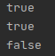
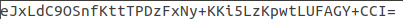
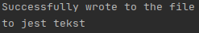
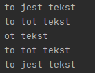

# Sprawozdanie z Laboratorium 6
### Autor: Krzysztof Hardek
## 2.1 Adapter
### Klasa RoundHole
Klasa kliencka, której interfejs jest niekompatybilny z użyteczna klasą serwisową
```java
public class RoundHole {
    private int radius;

    public RoundHole(int radius){
        this.radius = radius;
    }

    public boolean fits(RoundPeg peg){
        if(peg.getRadius() <= this.radius) return true;

        return false;
    }

    public int getRadius() {
        return radius;
    }
}
```
### Klasa RoundPeg
```java
public class RoundPeg {
    private int radius;

    public RoundPeg(int radius){
        this.radius = radius;
    }

    public int getRadius() {
        return radius;
    }
}

```
### Klasa SquarePeg
Klasa serwisowa, której interfejs jest niekompatybilny z klasą kliencką
```java
public class SquarePeg {
    private int width;

    public SquarePeg(int width){
        this.width = width;
    }

    public int getWidth() {
        return width;
    }
}
```
### Klasa SquarePegAdapter
Klasa realizująca wzorzec projektowy Adapter, która umożliwia nam korzystanie z klasy serwisowej
```java
public class SquarePegAdapter extends RoundPeg{
    private SquarePeg peg;

    public SquarePegAdapter(SquarePeg peg){
        super(0);
        this.peg = peg;
    }

    @Override
    public int getRadius(){
         double radius =  this.peg.getWidth() * Math.sqrt(2) / 2;
         int roundedRadius = (int) Math.ceil(radius);

         return roundedRadius;
    }
}
```
### Klasa Main
Prezentacja użycia
```java
public class Main {
    public static void main(String[] args){
        RoundHole hole = new RoundHole(5);
        RoundPeg rpeg = new RoundPeg(5);

        System.out.println(hole.fits(rpeg));

        SquarePeg smallSqpeg = new SquarePeg(5);
        SquarePeg largeSqpeg = new SquarePeg(10);

        SquarePegAdapter smallSqpegAdapter = new SquarePegAdapter(smallSqpeg);
        SquarePegAdapter largeSqpegAdapter = new SquarePegAdapter(largeSqpeg);

        System.out.println(hole.fits(smallSqpegAdapter));
        System.out.println(hole.fits(largeSqpegAdapter));
    }
}
```

## 2.2 Decorator
### Interfejs DataSource
```java
public interface DataSource {
    void writeData(String Data);

    String readData();
}
```
### Klasa FileDataSource
Podstawowa klasa zapisująca i czytająca z pliku, do której chcemy dodać funckjonalność
```java
public class FileDataSource implements DataSource{
    private String filename;

    public FileDataSource(String filename){
        this.filename = filename;
    }

    public void writeData(String data){
        try{
            File file = new File(filename);
            OutputStream os = new FileOutputStream(file);
            os.write(data.getBytes("UTF-8"));
            os.close();
            System.out.println("Successfully wrote to the file");
        }
        catch (Exception e){
            System.out.println("FileDataSource writeData" + e.getMessage());
        }
    }

    public String readData(){
        try{
            File file = new File(filename);
            FileInputStream fis = new FileInputStream(file);
            byte[] data = new byte[1024];

            int bytesRead = fis.read(data);
            fis.close();

            byte[] dataTrimmed = Arrays.copyOf(data, bytesRead);

            return new String(dataTrimmed, "UTF-8");
        }
        catch (Exception e){
            System.out.println("File error");
        }

        return null;
    }
}
```
### Klasa DataSourceDecorator
Dekorator, umożliwiający dodawanie nowych funkcjonalności
```java
public class DataSourceDecorator implements DataSource{
    private DataSource wrappee;

    public DataSourceDecorator(DataSource s){
        this.wrappee = s;
    }

    public void writeData(String data){
        wrappee.writeData(data);
    }

    public String readData(){
        return wrappee.readData();
    }
}
```
### Klasa EncryptionDecorator
Nowa funkcjonalność
```java
public class EncryptionDecorator extends DataSourceDecorator{
    private String secretKey = "superkluczasdasdasd";

    public EncryptionDecorator(DataSource s){
        super(s);
    }

    @Override
    public void writeData(String data) {
        String encryptedData = AES.encrypt(data, this.secretKey);
        super.writeData(encryptedData);
    }

    @Override
    public String readData() {
        String encryptedData = super.readData();
        return AES.decrypt(encryptedData, this.secretKey);
    }
}
```
### Klasa CompressionDecorator
Nowa funkcjonalność
```java
public class CompressionDecorator extends DataSourceDecorator{
    Deflater compresser;
    Inflater decompresser;

    public CompressionDecorator(DataSource s){
        super(s);
        this.compresser = new Deflater();
        this.decompresser = new Inflater();
    }

    @Override
    public void writeData(String data) {
        try{
            byte[] compressedBytes = new byte[1024];

            compresser.setInput(data.getBytes("UTF-8"));
            compresser.finish();
            int compressedBytesLength = compresser.deflate(compressedBytes);
            compresser.end();

            byte[] compressedBytesTrimmed = Arrays.copyOf(compressedBytes, compressedBytesLength);

            super.writeData(Base64.getEncoder().encodeToString(compressedBytesTrimmed));
        }
        catch (Exception e){
            System.out.println("CompressionDecorator writeData");
        }
    }

    @Override
    public String readData() {
        try{
            byte[] compressedData = Base64.getDecoder().decode(super.readData());
            byte[] decompressedData = new byte[1024];

            decompresser.setInput(compressedData, 0, compressedData.length);
            int decompressedDataLength = decompresser.inflate(decompressedData);
            decompresser.end();

            byte[] decompressedDataTrimmed = Arrays.copyOf(decompressedData, decompressedDataLength);

            return new String(decompressedDataTrimmed, "UTF-8");
        }
        catch (Exception e){
            System.out.println("CompressionDecorator readData" + e.getMessage());
        }

        return null;
    }
}
```
### Klasa AES
Klasa umożliwiająca szyfrowanie String
```java
public class AES {

    private static SecretKeySpec secretKey;
    private static byte[] key;

    public static void setKey(String myKey)
    {
        MessageDigest sha = null;
        try {
            key = myKey.getBytes("UTF-8");
            sha = MessageDigest.getInstance("SHA-1");
            key = sha.digest(key);
            key = Arrays.copyOf(key, 16);
            secretKey = new SecretKeySpec(key, "AES");
        }
        catch (NoSuchAlgorithmException e) {
            e.printStackTrace();
        }
        catch (UnsupportedEncodingException e) {
            e.printStackTrace();
        }
    }

    public static String encrypt(String strToEncrypt, String secret)
    {
        try
        {
            setKey(secret);
            Cipher cipher = Cipher.getInstance("AES/ECB/PKCS5Padding");
            cipher.init(Cipher.ENCRYPT_MODE, secretKey);
            return Base64.getEncoder().encodeToString(cipher.doFinal(strToEncrypt.getBytes("UTF-8")));
        }
        catch (Exception e)
        {
            System.out.println("Error while encrypting: " + e.getMessage());
        }
        return null;
    }

    public static String decrypt(String strToDecrypt, String secret)
    {
        try
        {
            setKey(secret);
            Cipher cipher = Cipher.getInstance("AES/ECB/PKCS5PADDING");
            cipher.init(Cipher.DECRYPT_MODE, secretKey);
            return new String(cipher.doFinal(Base64.getDecoder().decode(strToDecrypt)));
        }
        catch (Exception e)
        {
            System.out.println("Error while decrypting: " + e.getMessage());
        }
        return null;
    }
}
```
### Klasa Main
Prezentacja użycia
```java
public class Main {
    public static void main(String[] args){
        String data = "to jest tekst";

        DataSource fileDataSource = new FileDataSource("test.txt");
        DataSource compressionDecorator = new CompressionDecorator(fileDataSource);
        DataSource encryptionDecorator = new EncryptionDecorator(compressionDecorator);
        DataSource dataSourceDecorator = new DataSourceDecorator(encryptionDecorator);

        dataSourceDecorator.writeData(data);
        System.out.println(dataSourceDecorator.readData());
    }
}
```
Zaszyfrowana i skompresowana treść pliku  


Konsola  

## 2.3 Command
### Klasa Application
```java
public class Application {
    private Editor[] editors;
    private Editor activeEditor;
    private String clipboard;
    private CommandHistory history;

    public Application(){
        this.history = new CommandHistory();
    }

    public void executeCommand(Command c){
        c.execute();
        this.history.push(c);
    }

    public void undo(){
        Command c = history.pop();
        c.undo();
    }

    public void setClipboard(String clipboard){
        this.clipboard = clipboard;
    }

    public String getClipboard(){
        return this.clipboard;
    }
}
```
### Klasa CommandHistory
Klasa pozwala na przetrzymywanie historii wykonanych operacji i umożliwia ich cofnięcie
```java
public class CommandHistory {
    private ArrayList<Command> history;

    public CommandHistory(){
        this.history = new ArrayList<>();
    }

    public void push(Command c){
        this.history.add(c);
    }

    public Command pop(){
        try{
            Command c = this.history.get(this.history.size() - 1);

            this.history.remove(this.history.size() - 1);

            return c;
        }
        catch (IndexOutOfBoundsException e){
            return null;
        }
    }
}
```
### Klasa Editor
```java
public class Editor {
    private String text;
    private int startIndex;
    private int endIndex;

    public Editor(String text){
        this.text = text;
        this.startIndex = 0;
        this.endIndex = -1;
    }

    public String getSelection(){
        try{
            return this.text.substring(startIndex, endIndex);
        }
        catch (IndexOutOfBoundsException e){
            System.out.println(e.getMessage());
        }

        return "";
    }

    public void deleteSelection(){
        try{
            this.text = this.text.substring(0, startIndex) + this.text.substring(endIndex);
        }
        catch (IndexOutOfBoundsException e){
        }

        this.startIndex = 0;
        this.endIndex = -1;
    }

    public void replaceSelection(String text){
        try{
            this.text = this.text.substring(0, startIndex) + text + this.text.substring(endIndex);
        }
        catch (IndexOutOfBoundsException e){
        }

        this.startIndex = 0;
        this.endIndex = -1;
    }

    public void setText(String text){
        this.text = text;
        this.startIndex = 0;
        this.endIndex = -1;
    }

    public void setSelection(int startIndex, int endIndex){
        this.startIndex = startIndex;
        this.endIndex = endIndex;
    }

    public String getText() {
        return text;
    }
}
```
### Klasa Command
Interfejs, za pomocą którego wykonywane są komendy
```java
public class Command {
    protected Application app;
    protected Editor editor;
    private ArrayList<String> backup;

    public Command(Application app, Editor editor){
        this.app = app;
        this.editor = editor;
        this.backup = new ArrayList<>();
    }

    public void saveBackup(){
        this.backup.add(this.editor.getText());
    }

    public void undo(){
        try{
            String text = this.backup.get(backup.size() - 1);

            this.editor.setText(text);

            this.backup.remove(this.backup.size() - 1);
        }
        catch (IndexOutOfBoundsException e){
        }
    }

    public void execute(){
    }
}
```
### Klasa CopyCommand
Konkretna komenda
```java
public class CopyCommand extends Command{
    public CopyCommand(Application app, Editor editor){
        super(app, editor);
    }

    @Override
    public void execute() {
        this.app.setClipboard(this.editor.getSelection());
    }
}
```
### Klasa CutCommand
Konkretna komenda
```java
public class CutCommand extends Command{
    public CutCommand(Application app, Editor editor){
        super(app, editor);
    }

    public void execute(){
        super.saveBackup();

        String text = this.editor.getSelection();

        this.editor.deleteSelection();
        this.app.setClipboard(text);
    }
}
```
### Klasa PasteCommand
Konkretna komenda
```java
public class PasteCommand extends Command{
    public PasteCommand(Application app, Editor editor){
        super(app, editor);
    }

    public void execute(){
        super.saveBackup();

        String text = this.app.getClipboard();

        this.editor.replaceSelection(text);
    }
}
```
### Klasa UndoCommand
Konkretna komenda
```java
public class UndoCommand extends Command{
    public UndoCommand(Application app, Editor editor){
        super(app, editor);
    }

    @Override
    public void execute(){
        super.undo();
    }
}
```
### Klasa Main
Prezentacja działania
```java
public class Main {
    public static void main(String[] args){
        Application app = new Application();
        Editor editor = new Editor("to jest tekst");

        CopyCommand command = new CopyCommand(app, editor);
        editor.setSelection(0, 2);
        app.executeCommand(command);
        System.out.println(editor.getText());

        editor.setSelection(3, 6);
        PasteCommand command1 = new PasteCommand(app, editor);
        app.executeCommand(command1);
        System.out.println(editor.getText());

        editor.setSelection(0, 4);
        CutCommand command2 = new CutCommand(app, editor);
        app.executeCommand(command2);
        System.out.println(editor.getText());

        app.undo();
        System.out.println(editor.getText());

        app.undo();
        System.out.println(editor.getText());
    }
}
```
